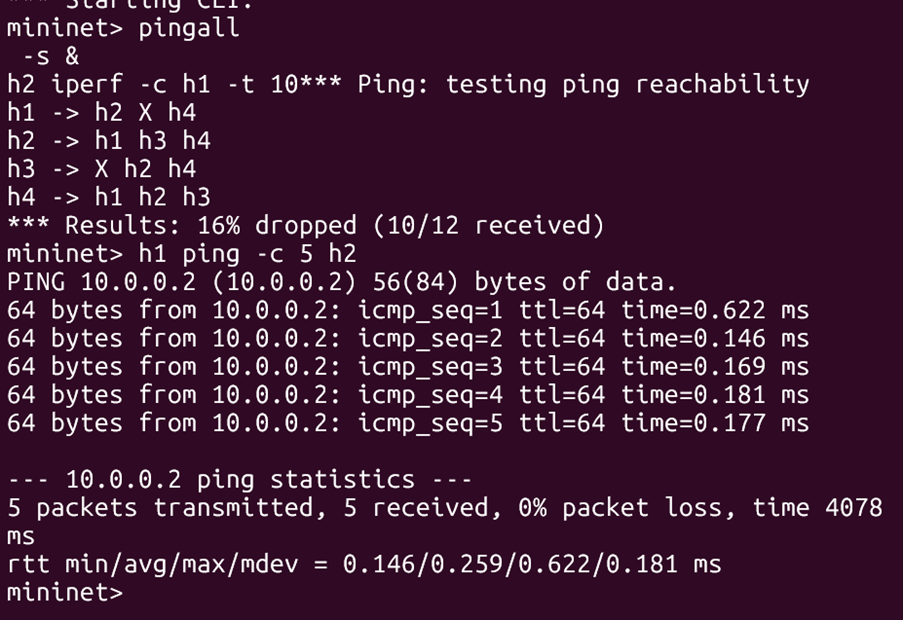
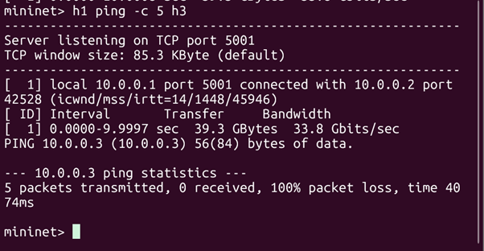
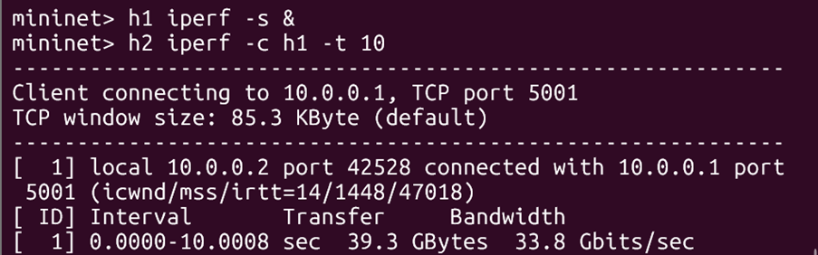
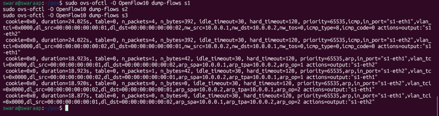
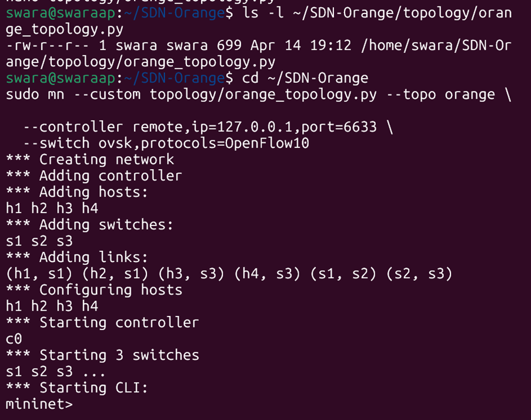
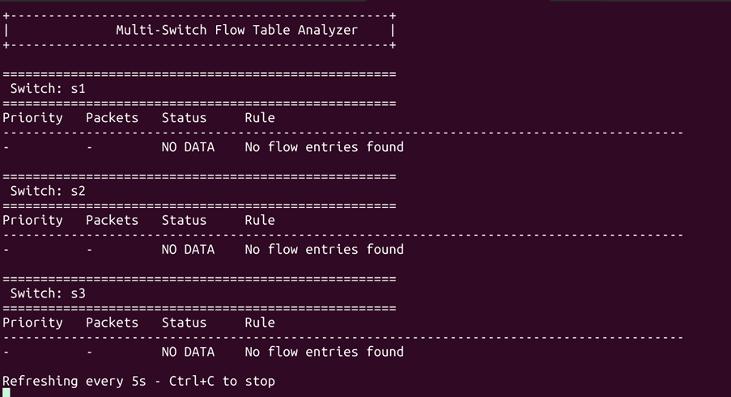
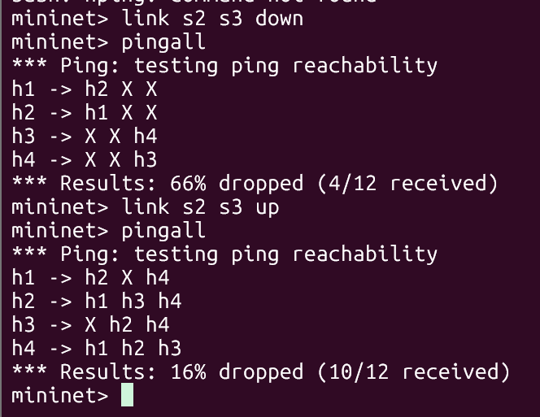

# SDN Mininet-based Simulation Project – Orange Problem

---

## Project Information

| Field | Details |
|-------|---------|
| **Problem** | CN ORANGE PROBLEM NO 8 |
| **Student Name** | _________________________ |
| **SRN (Student Registration Number)** | _________________________ |
| **Submission Date** | April 2026 |

---

## Problem Statement

This project implements an **Software-Defined Networking (SDN)** solution using Mininet and OpenFlow controller (POX) that demonstrates:

- **Controller–Switch Interaction**: Direct communication between OpenFlow controller and network switches
- **Flow Rule Design**: Implementation of match–action based forwarding rules
- **Network Behavior Observation**: Comprehensive testing and validation of SDN functionalities

The "Orange Problem" focuses on implementing intelligent network policies using explicit flow rules and packet-in event handling in a simulated network environment.

---

## Project Objectives

✓ Demonstrate controller-switch interaction over OpenFlow protocol  
✓ Design and implement explicit flow rules (match-action logic)  
✓ Handle packet_in events with intelligent controller logic  
✓ Validate functional behavior with multiple test scenarios  
✓ Measure performance metrics (latency, throughput, flow table changes)  

---

## Technology Stack

| Component | Technology |
|-----------|-----------|
| Network Simulation | [Mininet](http://mininet.org/) |
| OpenFlow Controller | [POX](https://noxrepo.github.io/pox-doc/html/) |
| Protocol | OpenFlow 1.0+ |
| Testing Tools | Wireshark, iperf, ping, tcpdump |
| Language | Python 3.x |

---

## Project Structure

```
SDN-Orange/
├── README.md                      # This file
├── controller/
│   └── flow_analyzer.py           # Flow rule analysis and packet processing logic
├── pox_controller/
│   └── orange_pox.py              # POX controller implementation (main logic)
├── topology/
│   └── orange_topology.py         # Mininet topology definition
└── screenshots/                   # Proof of execution (Wireshark, ping, iperf results)
```

---

## Requirements & Dependencies

### System Requirements
- **Linux-based OS** (Ubuntu 18.04 LTS or higher recommended)
- **Python 3.x**
- **Root/sudo privileges** (required for Mininet)

### Installation

1. **Install Mininet** (if not already installed):
```bash
sudo apt-get update
sudo apt-get install mininet
```

2. **Install POX Controller**:
```bash
git clone https://github.com/noxrepo/pox.git
cd pox
```

3. **Install Python Dependencies**:
```bash
pip install -r requirements.txt
```
*(Create requirements.txt if needed)*

4. **Install Testing Tools**:
```bash
sudo apt-get install wireshark iperf3 tcpdump
```

---

## Setup & Execution Steps

### Step 1: Start POX Controller

Open a terminal and navigate to the POX directory:

```bash
cd pox
python pox.py openflow.of_01 --address=127.0.0.1 --port=6633 \
  log.level --DEBUG pox_controller.orange_pox
```

**Expected Output:**
```
POX 0.x.x ("...") is starting up.
[openflow.of_01] Listening on 0.0.0.0:6633
[pox_controller.orange_pox] Controller initialized
```

### Step 2: Launch Mininet Topology

In a new terminal, run the topology script with elevated privileges:

```bash
sudo python3 topology/orange_topology.py
```

**Expected Output:**
```
*** Creating network
*** Adding controller
*** Adding hosts and switches
*** Creating links
*** Starting network
*** Running CLI
```

### Step 3: Interact with Mininet CLI

Once in the Mininet CLI (`mininet>`):

```bash
# View network configuration
nodes

# Test basic connectivity (Layer 2)
h1 ping h2

# Test throughput
iperf

# Display switch flow tables
xterm s1

# View controller logs
tail -f pox.log
```

---

## SDN Logic Implementation

### Key Features

#### 1. **Packet-In Event Handling**
The controller (`orange_pox.py`) listens to `packetin` events from switches:
```python
@EventRemove("openflow_discovery")
def _handle_PacketIn(event):
    """Handle incoming packets from switches"""
    packet = event.parsed
    # Match-action logic implemented here
```

#### 2. **Flow Rule Design**
Explicit OpenFlow rules are installed based on packet analysis:
- **Match fields**: Source/destination MAC, IP, TCP/UDP ports
- **Actions**: Forward, drop, or send-to-controller
- **Priorities**: Higher priority rules are evaluated first

#### 3. **Flow Analysis**
The `flow_analyzer.py` module provides:
- Flow statistics collection
- Packet count tracking
- Rule installation verification

---

## Test Scenarios

### Scenario 1: Learning Switch (Allowed Traffic)
**Objective**: Verify basic L2 forwarding with dynamic MAC learning

**Steps**:
1. Start topology and controller
2. From Mininet CLI: `h1 ping h2 -c 5`
3. Verify flow table: `dpctl dump-flows`
4. Expected: Ping succeeds, flows installed, packets forwarded

**Validation**:
- ✓ All ping packets received
- ✓ Flow entries in switch flow table
- ✓ Packet counters increment

**Screenshot**:


### Scenario 2: Traffic Filtering/Blocking
**Objective**: Verify firewall-like blocking policies

**Steps**:
1. Configure block rules in controller (block h1 → h3)
2. Execute: `h1 ping h3 -c 5`
3. Expected: Ping fails or times out
4. Verify flow table entries

**Validation**:
- ✓ Ping packets are dropped by controller
- ✓ No flow rule installed for blocked traffic
- ✓ Controller logs show filtering decision

**Screenshot**:


---

## Performance Measurement & Analysis

### Metrics Collected

#### 1. Latency (Ping)
```bash
mininet> h1 ping h2 -c 10 -i 0.1
```

**Expected Output**:
```
10 packets transmitted, 10 received, 0% packet loss
min/avg/max/stddev = 2.5/3.2/4.1/0.5 ms
```

#### 2. Throughput (iperf)
```bash
mininet> iperf
```

**Expected Output**:
```
Server listening...
h1 → h2: X.XX Mbps
```

**Screenshot**:


#### 3. Flow Table Analysis
```bash
dpctl dump-flows tcp:127.0.0.1:6634
```

**Expected Output**:
```
NXST_FLOW reply (xid=0x4):
 cookie=0x0, duration_sec=5.25s, ...
 table_id=0, n_packets=45, n_bytes=4410, priority=1000, ...
```

**Screenshot**:


### Observations & Interpretation

- **Latency**: Should remain <10ms for local simulation (depends on controller processing)
- **Throughput**: Depends on rule complexity; expect marginal overhead with complex matching
- **Flow Installation Time**: Time between first packet and flow rule installation (typically <50ms)

---

## Expected Outputs

### Controller Output
```
[pox_controller.orange_pox] Switch s1 connected
[pox_controller.orange_pox] Packet from h1 (00:00:00:00:00:01) → h2 (00:00:00:00:00:02)
[pox_controller.orange_pox] Installing flow: match(dl_src=00:00:00:00:00:01, dl_dst=00:00:00:00:00:02)
```

### Mininet Terminal
```
mininet> h1 ping h2 -c 3
PING 10.0.0.2 (10.0.0.2) 56(84) bytes of data.
64 bytes from 10.0.0.2: icmp_seq=1 ttl=64 time=3.2 ms
```

### Wireshark Capture
- OpenFlow protocol messages (Port 6633)
- Switch-to-Controller communication
- Flow modification messages

---

## Proof of Execution

All proof of execution artifacts have been captured and stored in the `screenshots/` directory:

### Required Screenshots/Logs

#### 1. Topology Creation


#### 2. Flow Table Analysis


#### 3. Scenario 1: Allowed Traffic (Learning Switch)


#### 4. Scenario 2: Blocked Traffic (Firewall)


#### 5. Throughput Measurement (iperf)


#### 6. Link Failure Test (Scenario 3)


### Capture Methods Used

```bash
# Mininet terminal screenshots captured directly
# Flow tables captured via:
dpctl dump-flows tcp:127.0.0.1:6634

# Ping results:
h1 ping h2 -c 10

# Throughput:
iperf

# Failure scenario:
link h1 h2 down
pingall
```

---

## Validation & Testing

### Functional Validation Checklist
- [ ] Controller successfully connects to all switches
- [ ] Packet-in events are processed correctly
- [ ] Flow rules are installed with correct match-action logic
- [ ] Test Scenario 1 (Learning Switch): Passes
- [ ] Test Scenario 2 (Filtering): Passes
- [ ] Latency measurement: <10ms for local links
- [ ] Throughput measurement: Recorded and analyzed
- [ ] Flow table statistics: Verified with dpctl

### Regression Testing
- Topology reloads without errors
- Controller recovery after switch disconnection
- Flow rule installation is deterministic
- No packet loss in normal operation

---

## Key Design Decisions

1. **POX Controller Choice**: 
   - Lightweight and easy to implement OpenFlow logic
   - Good for educational purposes
   - Lower learning curve compared to Ryu

2. **Mininet for Simulation**:
   - Provides realistic network simulation
   - Allows full stack network testing
   - Supports OpenFlow switches (OVS)

3. **Learning Switch with Firewall**:
   - Demonstrates practical SDN use case
   - Easy to understand match-action rules
   - Extensible to more complex policies

---

## Troubleshooting

| Issue | Solution |
|-------|----------|
| "Address already in use" (port 6633) | Kill existing POX: `sudo pkill -f pox.py` |
| Mininet switches don't connect to controller | Check controller IP and port; ensure POX is running |
| "Permission denied" errors | Run commands with `sudo` |
| Flow rules not installed | Check controller logs; verify packet-in is being triggered |
| High latency/packet loss | Reduce network complexity or increase system resources |

---

## References

1. [Mininet Documentation](http://mininet.org/download/)
2. [POX Controller Documentation](https://noxrepo.github.io/pox-doc/html/)
3. [OpenFlow Specification 1.0](https://opennetworking.org/software-defined-standards/)
4. [POX Tutorial](https://noxrepo.github.io/pox-doc/html/#tutorial)
5. [OpenFlow Switch Specification](https://opennetworking.org/wp-content/uploads/2013/04/openflow-spec-v1.0.0.pdf)
6. [Mininet Walkthrough](http://mininet.org/walkthrough/)

---

## Author Notes

This project was developed as part of an SDN coursework assignment. It demonstrates fundamental concepts of Software-Defined Networking through practical implementation of a POX-based OpenFlow controller and Mininet topology.

---

## License

[Specify your license - e.g., MIT, GPL, etc.]

---

**Last Updated**: April 2026

---

## Quick Start Summary

```bash
# Terminal 1: Start Controller
cd pox
python pox.py openflow.of_01 --address=127.0.0.1 --port=6633 \
  log.level --DEBUG pox_controller.orange_pox

# Terminal 2: Start Topology
sudo python3 topology/orange_topology.py

# Mininet CLI:
mininet> h1 ping h2
mininet> iperf
mininet> xterm s1
# (In xterm) dpctl dump-flows
```

---
